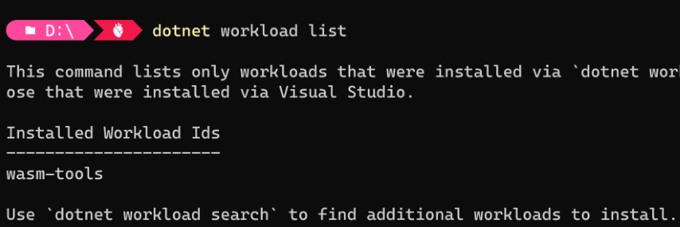

在开发WebAssembly程序时，时常会引用到原生的依赖项譬如：C语言写的Sqlite用来保存用户数据；Rust语言写的qrcode来生成二维码。那么怎么将原生依赖项静态链接到 .NET WebAssembly运行时，.NET6以前Blazor WebAssembly是没法做到，在.NET6才支持 Blazor WebAssembly 引用原生依赖项。

### 下载.NET WebAssembly 生成工具
在命令 shell 中运行 dotnet workload install wasm-tools 通过命令 dotnet workload list 来查看当前已安装的工作负载 


### 在项目文件中引用 NativeFileReference
原生依赖项通过NativeFileReference 项引用到项目中，在生成项目时，每个 NativeFileReference 都由 .NET WebAssembly 生成工具传递给 Emscripten （一个完整的WebAssembly的编译器工具链），以便对其进行编译并链接到运行时。  
NativeFileReference引用的原生依赖项可以是 C/C++ 代码文件或使用 Emscripten 编译的对象文件 (.o)/存档文件 (.a)/Bitcode (.bc)/独立 WebAssembly 模块 (.wasm)。  

### 原生依赖项是C代码文件
1. 创建新的 Blazor WebAssembly 项目 dotnet new blazorwasm --name BlazorNativeFile
2. 在根目录创建Test.c 文件
```c
int fact(int n)
{
if (n == 0) return 1;
return n * fact(n - 1);
}
```
3. 在应用程序的项目文件中为 Test.c 添加 NativeFileReference
```xml
<ItemGroup>
  <NativeFileReference Include="Test.c" />
</ItemGroup>
```
4. 在 Razor 组件中，为生成的 Test 库中的 fact 函数添加 DllImportAttribute，并从组件中的 .NET 代码调用 fact 方法。
```HTML
@page "/native-c-test"
  @using System.Runtime.InteropServices

  <PageTitle>Native C</PageTitle>

  <h1>Native C Test</h1>

  <p>
  		@@fact(3) result: @fact(3)
  </p>

  @code {
  		[DllImport("Test")]
  		static extern int fact(int n);
  }
```

### 原生依赖是Emscripten编译的对象文件
在多数情况下原生依赖不止是单个的文件，这时候可以用 Emscripten 编译源代码成后缀为 .o的对象文件，譬如我们要在wasm中引用sqlite，必须把sqlite的源文件编译进WebAssembly，这样在wasm runtimes中才可以运行。
1. [下载安装emsdk](https://emscripten.org/docs/getting_started/downloads.html)
2. 使用命令 `emcc.bat sqlite3.c -shared -o e_sqlite3.o` 编译sqlite3.c 成wasm可用的对象文件
3. 在应用程序的项目文件中为 e_sqlite3.o 添加 NativeFileReference
```xml
<ItemGroup>
  <NativeFileReference Include="Test.c" />
  <NativeFileReference Include="Data\e_sqlite3.o" />
</ItemGroup>
```
4. 新增Directory.build.props文件 允许不安全区块
```xml
 <Project>
  <PropertyGroup>
    <AllowUnsafeBlocks>true</AllowUnsafeBlocks>
    <EmccExtraLDFlags>-s WARN_ON_UNDEFINED_SYMBOLS=0</EmccExtraLDFlags>
  </PropertyGroup>
 </Project>
```
5. 添加对Microsoft.EntityFrameworkCore.Sqlite程序集的引用
6. 在wasm组件中使用ef core sqlite
```HTML
@page "/native-sqlite"
	<PageTitle> native sqlite</PageTitle>
	<div>
			<h1>use efcore and sqlite on wasm</h1>
			<button @onclick="RunEFCore">Test Sqlite</button>
	</div>
	@code {
		public class TestDbContext:DbContext
		{
				public DbSet<Part> Parts { get; set; }
				protected override void OnConfiguring(DbContextOptionsBuilder options)=>options.UseSqlite($"Data Source=test.db");
		}
		public record Part
		{
				public int Id { get; set; }

				public int NumCount { get; set; }
		}

		private async Task RunEFCore()
		{
				using var dbContext = new TestDbContext();
				await dbContext.Database.EnsureCreatedAsync();

				var nextNumber = dbContext.Parts!.Count() + 1;
				dbContext.Parts!.Add(new Part { NumCount = nextNumber });
				await dbContext.SaveChangesAsync();

				Console.WriteLine();
				await foreach (var part in dbContext.Parts!.AsAsyncEnumerable())
				{
						Console.WriteLine($"ID: {part.Id}, number count: {part.NumCount}");
				}
		}
	}
```

### 参考
- [ASP.NET Core Blazor WebAssembly native dependencies](https://learn.microsoft.com/en-us/aspnet/core/blazor/webassembly-native-dependencies)
