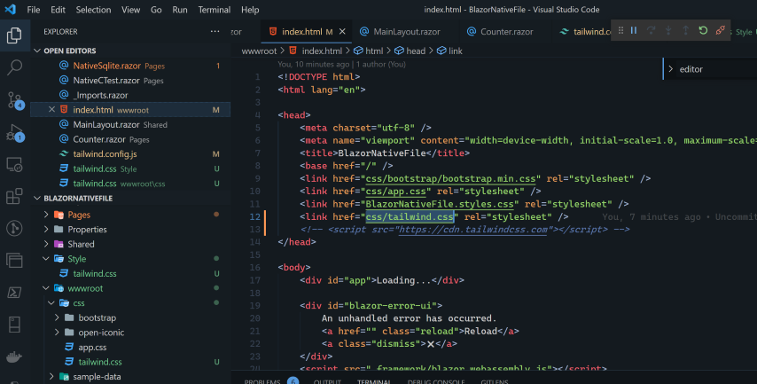

在进行Blazor开发时怎么把Tailwind这个css框架集成进Blazor渲染组件美化站点，下面介绍三种方法Blazor App集成Tailwind css:
- 将Play CDN添加到Blazor应用程序中
- 将Tailwind CSS添加到Blazor项目中
- 使用Tailwind CLI进行集成

### Play CDN添加到Blazor应用程序中
使用Play CDN，在浏览器中直接试用Tailwind，无需任何构建步骤。Play CDN只为开发目的而设计，并不是生产的最佳选择。要在Blazor App中添加Play CDN，我们需要在主机页面的head元素（Blazor WebAssembly的index.html或Blazor Server的_hosts.cshtml）中添加以下脚本标签。
```HTML
<head>
  <script src="https://cdn.tailwindcss.com"></script>
</head>
```
在添加脚本后我们就可以在razor组件中使用tailwind样式，当程序运行时Play CDN将必要的样式生成到head元素的样式标签中，这也是Tailwind v3 默认使用Jit的最大特性。 例如我们用tailwind utility classes 更改Blazor组件 Counter.razor 的button元素
```HTML
<button class="bg-blue-500 hover:bg-blue-700 text-white font-bold py-2 px-4 rounded"
@onclick="IncrementCount">
Click me
</button>
```
Play CDN生成以下样式标签


### 通过NPM使用Tailwind CLI
在Tailwind v3中，JiT模式现在是默认的。这意味着我们需要运行一个进程(Tailwind CLI)，观察Tailwind CSS类的使用情况，并根据需要重新编译输出的CSS，提供给Blazor 应用程序使用。
1. 使用以下命令安装Tailwind CLI npm install -g tailwindcss
2. 在Blazor项目的根目录运行 npx tailwindcss init 将在根目录中创建一个新的默认的Tailwind配置文件名为tailwind.config.js
```shell
module.exports = {
  content: [],
  theme: {
    extend: {},
  },
  plugins: [],
}
```
3. 在tailwind.config.js文件中content表示那些文件文件需要Tailwind CLI监控，在一个Blazor应用程序中，这些文件将是razor文件，然后是Blazor WebAssembly的html文件（index.html），或者是Blazor服务器的cshtml文件（hosts.cshtml），更改content为 content: ["./**/*.{razor,html,cshtml}","./*.{razor,html,cshtml}"]
4. 在根目录上新增一个css源文件Style/app.css以便Tailwind CLI能编译Blazor App最终使用的CSS文件，在源文件css中添加tailwind指令 @tailwind base; @tailwind components; @tailwind utilities; 这些是Tailwind的指令将根据Blazor App引用的Tailwind css替换成任何需要的类，可以在这个文件中添加任意的CSS类，它们将出现在最终输出的CSS文件中
5. 在项目的根目录运行 npx tailwindcss -i ./Styles/tailwind.css -o ./wwwroot/css/tailwind.css --watch 命令输出的最终使用的CSS文件，如Blazor App对Tailwind css引用有更新将自动更新到输出文件中
6. 在主机页面的head元素（Blazor WebAssembly的index.html或Blazor Server的_hosts.cshtml）中添加对输出css文件的引用
```HTML
<head>
  <link href="css/tailwind.css" rel="stylesheet" />
</head>
```
dotnet watch run 运行Blazor App

发布应用程序时可以使用CLI来生成最终CSS的最小化版本用命令 npx tailwindcss -i ./Styles/tailwind.css -o ./wwwroot/css/tailwind.css --minify

### 把Tailwind Css做为PostCss的插件
对于已经存在的前端项目通过添加tailwind css作为PostCss的插件来集成至现有的项目是一种最有效的方式。
1. 打开已存在项目的根目录如果不是nodejs项目，使用命令 npm init 创建一个package.json文件
2. 通过命令 npm install tailwindcss postcss autoprefixer postcss-cli 添加依赖包
3. 新增 postcss.config.js 配置PostCSS
```SHELL
module.exports = {
  plugins: {
    tailwindcss: {},
    autoprefixer: {},
  }
}
```
4. 通过命令 npx tailwindcss init 配置tailwind css
5. 在package.json 文件scripts中添加编译tailwindcss脚本 "buildcss": "postcss Style/posttailwind.css -o wwwroot/css/posttailwind.css"
6. 在主机页面的head元素（Blazor WebAssembly的index.html或Blazor Server的_hosts.cshtml）中添加对输出css文件的引用
7. npm run buildcss 即可产生你在Blazor App中引用的tailwind css
8. Visual Studio在构建/重新构建项目时运行NPM命令，在项目文件中新增
```XML
 <Target Name="PostBuild" AfterTargets="PostBuildEvent">
  <Exec Command="npm run buildcss" />
</Target>
```

#### 参考
[Integrating tailwindcss with blazor](https://codewithmukesh.com/blog/integrating-tailwind-css-with-blazor/)
