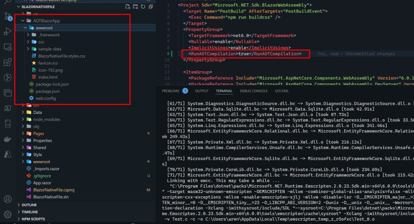
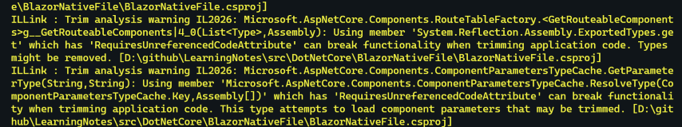

dotNET6支持Blazor WebAssembly超前编译（AOT编译），AOT编译是指在程序执行前，通常在构建时，将一种（通常）高级编程语言编译成一种（通常）低级语言，以减少运行时需要执行的工作量。Blazor WebAssembly支持AOT编译的优点是提高了应用程序运行时的性能，因为减少了把程序代码编译成机器码的工作；但增加了Blazor WebAssembly App的大小,因此通常在被首次请求时，下载到客户端的时间会更长。
### wasm 启用AOT编译
如果没有启用 AOT 编译，则 Blazor WebAssembly 应用使用在 WebAssembly 中实现的 .NET 中间语言 (IL) 解释器在浏览器上运行。 由于 .NET 代码已经过解释，因此应用的运行速度通常比在服务器端 .NET 即时 (JIT) 运行时上要慢。 AOT 编译将应用的 .NET 代码直接编译到 WebAssembly 中来供浏览器进行本机 WebAssembly 执行，从而处理这一性能问题。 AOT 性能改进可使执行 CPU 密集型任务的应用得到极大改进。 若要启用 WebAssembly AOT 编译，请将设置为true的 <RunAOTCompilation> 属性添加到 Blazor WebAssembly 应用的项目文件中
```xml
<PropertyGroup>
  <RunAOTCompilation>true</RunAOTCompilation>
</PropertyGroup>
```
使用命令 `dotnet publish -c Release -o AOTBlazorApp` 发布应用


### Blazor AOT编译和JIT编译包对比
在启用AOT编译后Publish的包文件达到惊人的115m,而未启用AOT编译的Blazor应用程序包文件才30m,AOT 编译的 Blazor WebAssembly 应用的大小通常比编译到 .NET IL 中的应用大小要大。 虽然大小差异取决于应用，则大多数 AOT 编译的应用大约是其 IL 编译的版本的两倍大。 这意味着使用 AOT 编译是用加载时间性能换取运行时性能。 使用 AOT 编译是否值得进行这种权衡取决于你的应用。 CPU 密集型的 Blazor WebAssembly 应用通常从 AOT 编译中受益最大。

### 配置裁边器
AOT编译既然已经增加了Blazor APP应用的大小，那怎么配置Blazor App的裁边器以此控制AOT编译应用的大小。在Publish时启用裁边器，将设置为true的 <PublishTrimmed> 对整个应用剪裁。
```xml
<PropertyGroup>
  <PublishTrimmed>true</PublishTrimmed>
</PropertyGroup>
```
在设置裁边器之后启用 <SuppressTrimAnalysisWarnings> 属性设置为 false 来显示关于反射的类型的警告。
```xml
<PropertyGroup>
	...
  <SuppressTrimAnalysisWarnings>false</SuppressTrimAnalysisWarnings>
</PropertyGroup>
```
使用命令 `dotnet publish -c Release -o TrimmingAOTBlazorApp` 发布应用 SuppressTrimAnalysisWarnings 会在build应用时显示警告

设置裁边器之后AOT编译发布Blazor App后包的大小为 110m+并没有明显的改变不知道那里设置的不对。
