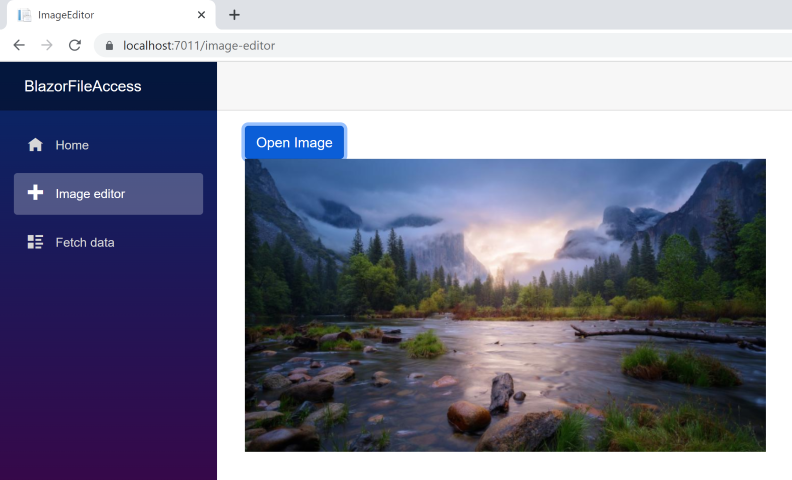
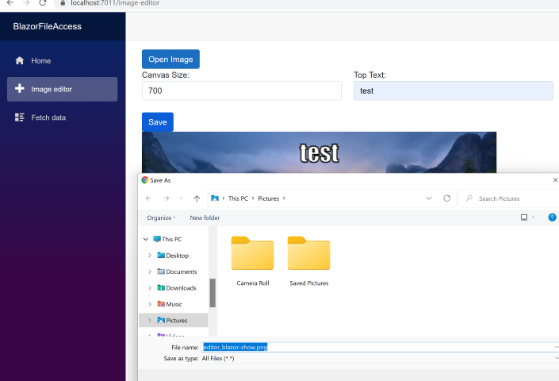
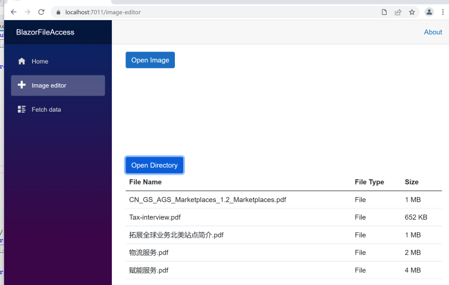

如果你想与用户的文件系统互动，那么你需要使用HTML标准来访问文件系统,常见的访问本地文件的几种方式：读取文件并展示文件内容，修文件并保存至本地以及读取文件目录，利用浏览器的本地文件API并用JSInterop将其封装起来然后从Blazor向其传递文件流达到访问用户文件系统的目的。
### 读取图片并且展示
创建blazor webassembly项目 dotnet new blazorwasm --name BlazorFileAccess 在 index.html文件 <body>标记中增加js方法用来操作打开的文件，同时在根目录wwwroot 中增加js文件 fileAccess用户读取打开文件的参数。
```HTML
<body>
...
<script>
window.jSReference = (element) => { return element.valueOf(); }
window.getAttribute = (object, attribute) => { return object[attribute]; }
window.setAttribute = (object, attribute, value) => { object[attribute] = value; }
</script>
</body>
```
fileAccess 文件内容
```JS
export function size(array) { return array.length; }
export function getAttribute(object, attribute) { return object[attribute]; }
export async function arrayFrom(values) {
    var res = []
    for await (let value of values) {
        res.push(value);
    }
    return res;
}
```
新增 ImageEditor.razor 组件button用来打开文件对话窗，canvas用来展示选择的图片
```html
<PageTitle>ImageEditor</PageTitle>
<div>
  <button @onclick="OpenFilePicker" class="btn btn-primary">Open Image</button>
</div>
<div>
  <canvas @ref=CanvasReference width=@CanvasSize height=@CanvasSize></canvas>
</div>
```
新增 FileSystemAccessService用来封装文件操作，打开文件对话框需要利用浏览器的本地文件API如FileSystemAccessService中的方法ShowOpenFilePickerAsync打开文件对话框，其中OpenFilePickerOptions确定文件对话框打开的初始位置和能选中的文件类型
```C#
public async Task<FileSystemFileHandle[]> ShowOpenFilePickerAsync(OpenFilePickerOptions? openFilePickerOptions = null)
{
	IJSInProcessObjectReference helper = await moduleTask.Value;
	IJSObjectReference jSFileHandles = await jsRuntime.InvokeAsync<IJSObjectReference>("window.showOpenFilePicker",
			openFilePickerOptions?.Serializable());
	var length = await helper.InvokeAsync<int>("size", jSFileHandles);
	return await Task
			.WhenAll(Enumerable.Range(0, length)
			.Select(async i => new FileSystemFileHandle
			(await jSFileHandles.InvokeAsync<IJSObjectReference>("at", i), helper)
			).ToArray());
}
```
打开文件后在canvas标记中显示图片
```C#
public async Task DrawImage()
{
	if (JS2dContext == null) return;
	var imageWidth = await jSRuntime.InvokeAsync<double>("getAttribute", JSImageBitmap, "width");
	var imageHeight = await jSRuntime.InvokeAsync<double>("getAttribute", JSImageBitmap, "height");
	ImageDrawWidth = (imageWidth > imageHeight ? 1 : imageWidth / imageHeight) * CanvasSize;
	ImageDrawHeight = (imageWidth < imageHeight ? 1 : imageHeight / imageWidth) * CanvasSize;
	await jSRuntime.InvokeVoidAsync("setAttribute", JSCanvas, "width", ImageDrawWidth);
	await jSRuntime.InvokeVoidAsync("setAttribute", JSCanvas, "height", ImageDrawHeight);
	await JS2dContext.InvokeVoidAsync("drawImage", JSImageBitmap, 0, 0, ImageDrawWidth, ImageDrawHeight);
}
```


### 修改图片并保存在本地目录
在打开文件编辑文件并打开文件保存对话框保存修改后的文件，在ImageEditor组件中增加编辑选项和保存 button，当点击保存的时候调用save方法
```HTML
<div class="row">
	<div class="form-group col">
			<label for="canvasSize">Canvas Size:</label>
			<input id="canvasSize" type="number" @oninput="WriteCanvasSize" class="form-control" value=@CanvasSize/>
	</div>
	 <div class="form-group col">
			<label for="topText">Top Text:</label>
			<input id="topText" @oninput="WriteTopText" class="form-control" />
	</div>
	<div class="form-group col">
			<label for="bottomText">Bottom Text:</label>
			<input id="bottomText" @oninput="WriteBottomText" class="form-control" />
	</div>
</div>
<br />
<button class="btn btn-primary" @onclick=Save>Save</button>
<br />
```
```C#
public async Task Save()
{
	FileSystemFileHandle? saveFileHandle = null;
	try
	{
			var options = new SaveFilePickerOptions()
			{
					StartIn = WellKnownDirectory.Pictures,
					SuggestedName = string.Concat("editor_", FileHandle.Name)
			};
			saveFileHandle = await FileSystemAccessService.ShowSaveFilePickerAsync(options);
	}
	catch (JSException jsex)
	{
			Console.WriteLine(jsex);
	}
	finally
	{
			if (saveFileHandle != null && JSCanvas != null)
			{
					var blobCallback = new BlobCallback(jSRuntime, await FileSystemAccessService.HelperAsync());
					blobCallback.Callback = async (BlobHandler blobhandler) =>
						 {
								 var writable = await saveFileHandle.CreateWritableAsync();
								 await writable.WriteAsync(blobhandler);
								 await writable.CloseAsync();
						 };
					await blobCallback.ToBlobAsync(JSCanvas);
			}
	}
}
```
在FileSystemAccessService中增加保存文件的对话框
```C#
public async Task<FileSystemFileHandle> ShowSaveFilePickerAsync(SaveFilePickerOptions? saveFilePickerOptions = null)
{
	IJSInProcessObjectReference? helper = await moduleTask.Value;
	IJSObjectReference? jSFileHandle = await jsRuntime.InvokeAsync<IJSObjectReference>("window.showSaveFilePicker",
			saveFilePickerOptions?.Serializable());
	return new FileSystemFileHandle(jSFileHandle, helper);
}
```


### 读取文件目录
在ImageEditor组件中增加打开目录button，当点击打开目录时调用OpenDictoryPicker方法
```html
<div>
    <button @onclick="OpenDictoryPicker" class="btn btn-primary">Open Directory</button>
</div>
<table class="table">
    <thead>
        <tr>
            <th>File Name</th>
            <th>File Type</th>
            <th>Size</th>
        </tr>
    </thead>
    <tbody>
        @foreach (var fileModel in RootDictoryModel.Children)
        {
            <tr>
                <td>@fileModel.Name</td>
                <td>@fileModel.Kind</td>
                <td>@ReadableByteSize(@fileModel.Size)</td>
            </tr>
        }
    </tbody>
</table>
```
OpenDictoryPicker方法
```C#
protected async Task OpenDictoryPicker()
{
	FileSystemDirectoryHandle? directoryHandle = null;
	try
	{
			var options = new DirectoryPickerOptions() { StartIn = WellKnownDirectory.Pictures };
			directoryHandle = await FileSystemAccessService.ShowDirectoryPickerAsync(options);
	}
	catch (JSException ex)
	{
			Console.WriteLine(ex);
	}
	finally
	{
			if (directoryHandle != null)
			{
					await BreadthFirstTraversal(directoryHandle);
			}
	}
}
```


#### 参考
[Blazor File System Access](https://github.com/KristofferStrube/Blazor.FileSystemAccess)
