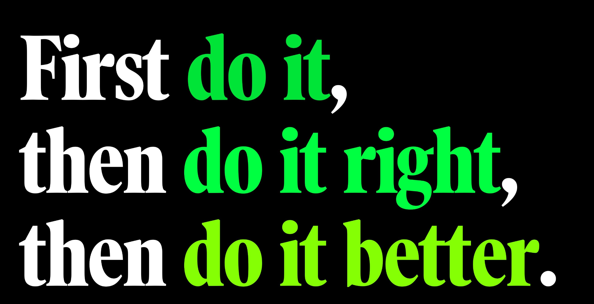

先行动通往成功的旅程通常从迈出第一步开始，而这第一步可能是最难迈出的。很容易陷入对失败的恐惧或追求完美的欲望，但我希望这句我在2013年首次分享的引语能够提醒我们，在2024年开始时，开始行动的重要性。

### 随时随地开始
"如果必要，慢慢开始。如果必要，从小处开始。如果必要，私下开始。只要开始。" - 詹姆斯·克利尔
迈出第一步并不要求完美或立即掌握。关键是克服惯性，采取行动，因为这个行动将带来进步、学习，如果你幸运且坚持不懈，最终带来成功。当你开始时，你给自己成长、适应和前进的机会。

### 开始的力量
开始一个新项目或习惯往往让人感到艰巨。心理学家指出，我们往往高估了开始的痛苦，低估了我们坚持的能力。然而，研究表明，“小的开始”比最初的热情或早期的进展更能预测最终的成功。这种现象被称为新起点效应 - 迈出第一步激发我们的活力并增强动力。

### 拥抱MVP思维
开始做=推出最简单的MVP
最小可行产品（MVP）是指产品或想法的最简单版本，它允许你进行测试、收集反馈并进行迭代。通过拥抱这种思维（只要做出一些东西 - 即使粗糙，作为原型或草稿，都没关系），你专注于进步而不是完美，理解将某些东西推出到世界上比等待完美时机更有价值。

### 扩大你的舒适区
冒险走出自己的舒适区可能引发失败的恐惧。积极面对不适不仅建立自信和技能，研究表明它还使我们更愿意学习。认识到恐惧往往是思维促使我们成长的方式。不要让它阻止你前进。

### 完善和纠正
一旦你迈出了第一步，推出了你的MVP，就是时候进行完善和纠正了。这个阶段是关于从反馈中学习，找出改进的方向，并相应地进行调整。这是一个机会来对你的想法进行迭代，确保它满足你的受众或客户的需求，同时与你的愿景保持一致。

### 培养好奇心和韧性
以好奇心和韧性面对新的挑战，可以使我们走出舒适区更具持续性和愉悦性。培养对成长机会的好奇心，以及你应对这些机会的能力。设定小挑战，逐步扩大你的视野。面对不可避免的挫折，避免自我批评，调动起韧性 - 恢复、学习和继续前进的能力。自我同情、适应性和保持全局视角在这里非常重要。通过持续的努力，你会对自己开始、犯错误、学习和迈向精通的能力建立信心。

### 追求持续改进
做得更好 = 朝着理想的最终状态迭代
旅程并不只在于做对，最后一步是不断改进，追求卓越和成长，通过朝着理想的最终状态进行迭代，你展示了对进步的承诺，确保你的产品、想法或项目保持相关性、创新和成功。

### 设定新的目标
随着你的改进，明确何时你已经“完成”或更新你的目标。顶级运动员通过累积边际收益将微小的收益转化为竞争优势。确定潜在改进的领域，并设定可衡量的拉伸目标，从提高效率到增强用户满意度。克服进展的最大障碍："进展的最大障碍不是缺乏资源或才能，而是对失败的恐惧。"。认识到对失败的恐惧是追求成功中最大的障碍，让你能够直面它。通过承认这种恐惧，你可以专注于迈出第一步，知道一旦球开始滚动，保持它运动起来就变得容易得多。记住，开始就是战胜一半。不要等到你感觉准备好，因为完美的时刻可能永远不会到来。

### 要点
与其追求完美的执行，不如拥抱开始的力量 - 推出一个MVP，软启动一个计划，或设定一个里程碑。进步带来动力。通过简单地开始，你打开了成长和创新的大门。其余的会随之而来。拥抱开始的力量，然后不断迭代，直到你满意为止。

### 原文
[First do it, then do it right, then do it better](https://twitter.com/addyosmani/status/1739052802314539371)
